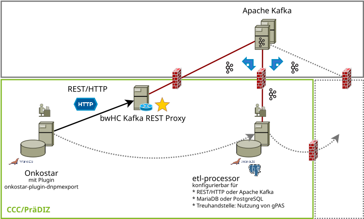

# bwHC Kafka Rest Proxy

bwHC MTB-File REST Proxy für Kafka

### Einordnung innerhalb einer DNPM-ETL-Strecke

Diese Anwendung erlaubt das Weiterleiten von REST Anfragen mit einem Request-Body und Inhalt eines bwHC MTB-Files
sowie `Content-Type` von `application/json` an einen Apache Kafka Cluster.

Verwendung im Zusammenspiel mit https://github.com/CCC-MF/etl-processor



## Konfiguration

Die Anwendung lässt sich mit Umgebungsvariablen konfigurieren.

* `APP_KAFKA_SERVERS`: Zu verwendende Kafka-Bootstrap-Server als kommagetrennte Liste
* `APP_KAFKA_TOPIC`: Zu verwendendes Topic zum Warten auf neue Anfragen. Standardwert: `etl-processor_input`
* `APP_SECURITY_TOKEN`: Verpflichtende Angabe es Tokens als *bcrypt*-Hash

## HTTP-Requests

Die folgenden Endpunkte sind verfügbar:

* **POST** `/mtbfile`: Senden eines MTB-Files
* **DELETE** `/mtbfile/:patient_id`: Löschen von Informationen zu dem Patienten

Übermittelte MTB-Files müssen erforderliche Bestandteile beinhalten, ansonsten wird die Anfrage zurückgewiesen.

Zum Löschen von Patienteninformationen wird intern ein MTB-File mit Consent-Status `REJECTED` erzeugt und weiter
geleitet. Hier ist kein Request-Body erforderlich.

Bei Erfolg enthält die Antwort im HTTP-Header `x-request-id` die Anfrage-ID, die auch im ETL-Prozessor verwendet
wird.

### Authentifizierung

Requests müssen einen HTTP-Header `authorization` für HTTP-Basic enthalten. Hier ist es erforderlich, dass der
Benutzername `token` gewählt wird.

Es ist hierzu erforderlich, die erforderliche Umgebungsvariable `APP_SECURITY_TOKEN` zu setzen. Dies kann z.B. mit
*htpasswd* erzeugt werden:

```
htpasswd -Bn token
```

Der hintere Teil (hinter `token:`) entspricht dem *bcrypt*-Hash des Tokens.

### Beispiele für HTTP-Requests und resultierende Kafka-Records

Beispiele für gültige HTTP-Requests zum Übermitteln und Löschen eines MTB-Files.

#### Übermittlung eines MTB-Files

Anfrage mit *curl*:

```bash
curl -u token:very-secret \
  -H "Content-Type: application/json" \
  --data '{"consent":{"id":"C1","patient":"P1","status":"active"},"episode":{"id":"E1","patient":"P1","period":{"start":"2024-03-01"}},"patient":{"id":"P1","gender":"unknown"}}' \
  http://localhost:3000/mtbfile
```

Antwort:

```
HTTP/1.1 202 Accepted
x-request-id: 1804d5c1-af3d-4f75-81a0-d9ca7c9739ef
content-length: 0
date: Sat, 09 Mar 2024 11:16:44 GMT
```

Resultierender Kafka-Record:

* **Key**: `{"pid":"P1"}`
* **Headers**:
    * `requestId`: `1804d5c1-af3d-4f75-81a0-d9ca7c9739ef`
* **Value**: `{"consent":{"id":"C1","patient":"P1","status":"active"},"episode":{"id":"E1","patient":"P1","period":{"start":"2024-03-01"}},"patient":{"gender":"unknown","id":"P1"}}`

#### Löschen von Patienten

Anfrage auch hier mit **curl**:

```bash
curl -v -u token:very-secret \
  -H "Content-Type: application/json" \
  -X DELETE \
  http://localhost:3000/mtbfile/P1
```

Antwort:

```
HTTP/1.1 202 Accepted
x-request-id: 8473fa67-8b18-4e8f-aa89-874f74fcc672
content-length: 0
date: Sat, 09 Mar 2024 11:24:35 GMT
```

Resultierender Kafka-Record:

* **Key**: `{"pid":"P1"}`
* **Headers**:
    * `requestId`: `8473fa67-8b18-4e8f-aa89-874f74fcc672`
* **Value**: `{"consent":{"id":"","patient":"P1","status":"rejected"},"episode":{"id":"","patient":"P1","period":{"start":""}},"patient":{"gender":"unknown","id":"P1"}}`

Es werden keine weiteren patientenbezogenen Daten übermittelt.

In optionaler Verbindung mit [Key-Based-Retention](https://github.com/CCC-MF/etl-processor#key-based-retention) wird lediglich der
letzte und aktuelle Record, hier die Information eines Consent-Widerspruchs, in Kafka vorgehalten.

Trifft dieser Kafka-Record im [ETL-Prozessor](https://github.com/CCC-MF/etl-processor) ein, so wird dort ebenfalls eine
Löschanfrage ausgelöst, da der Consent-Status den Wert `rejected` hat.